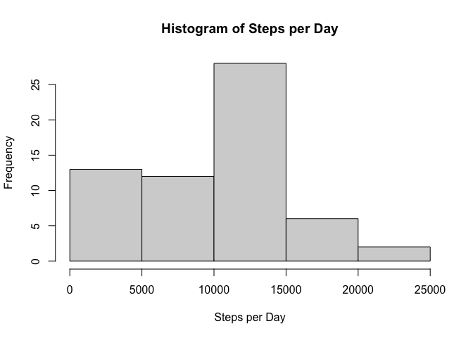
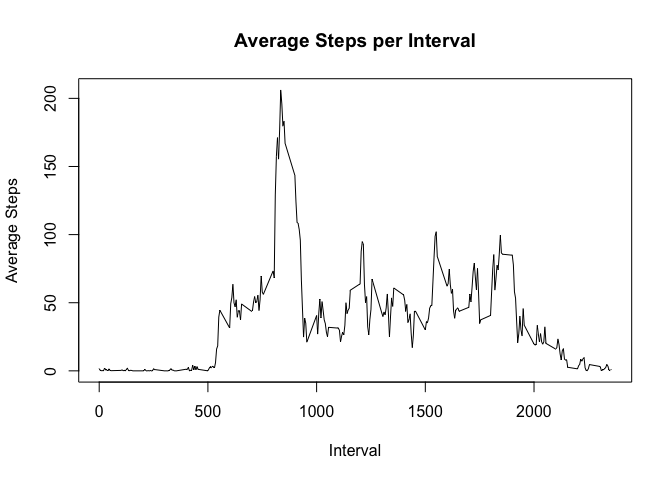
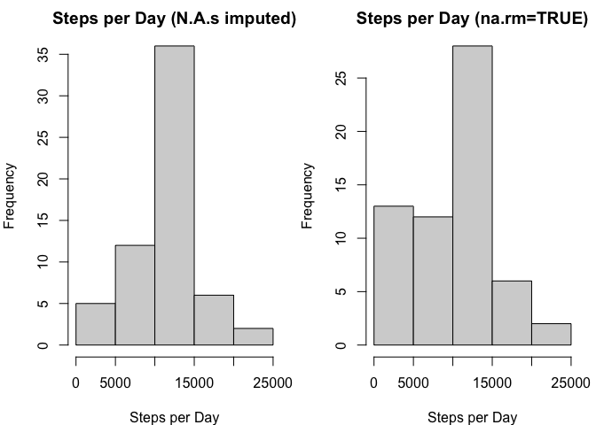
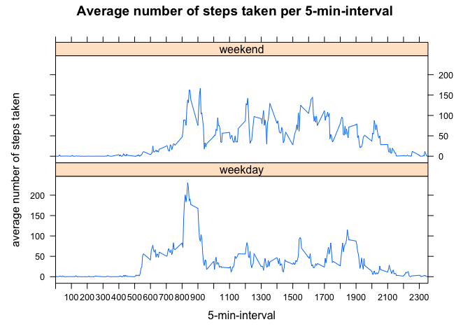

```r
# set global options echo=TRUE
knitr::opts_chunk$set(echo=TRUE)

# set working directory!
```
## Preface

### Introduction

It is now possible to collect a large amount of data about personal movement using activity monitoring devices such as a Fitbit, Nike Fuelband, or Jawbone Up. These type of devices are part of the “quantified self” movement – a group of enthusiasts who take measurements about themselves regularly to improve their health, to find patterns in their behavior, or because they are tech geeks. But these data remain under-utilized both because the raw data are hard to obtain and there is a lack of statistical methods and software for processing and interpreting the data.

This assignment makes use of data from a personal activity monitoring device. This device collects data at 5 minute intervals through out the day. The data consists of two months of data from an anonymous individual collected during the months of October and November, 2012 and include the number of steps taken in 5 minute intervals each day.

The data for this assignment can be downloaded from the course web site:

Dataset: [Activity monitoring data(52K)](https://d396qusza40orc.cloudfront.net/repdata%2Fdata%2Factivity.zip)

The variables included in this dataset are:

**steps**: Number of steps taking in a 5-minute interval (missing values are coded as \color{red}{\verb|NA|}NA)

**date**: The date on which the measurement was taken in YYYY-MM-DD format

**interval**: Identifier for the 5-minute interval in which measurement was taken

The dataset is stored in a comma-separated-value (CSV) file and there are a total of 17,568 observations in this dataset.

### Questions

**1. Loading and preprocessing the data**

Show any code that is needed to

+ Load the data (i.e. \color{red}{\verb|read.csv()|}read.csv())

+ Process/transform the data (if necessary) into a format suitable for your analysis


**2. What is the mean total number of steps taken per day?**

For this part of the assignment, you can ignore the missing values in the dataset.

+ Calculate the total number of steps taken per day

+ If you do not understand the difference between a histogram and a barplot, research the difference between them. Make a histogram of the total number of steps taken each day

+ Calculate and report the mean and median of the total number of steps taken per day


**3. What is the average daily activity pattern?**

+ Make a time series plot (i.e. \color{red}{\verb|type = "l"|}type = "l") of the 5-minute interval (x-axis) and the average number of steps taken, averaged across all days (y-axis)

+ Which 5-minute interval, on average across all the days in the dataset, contains the maximum number of steps?


**4. Imputing missing values**

Note that there are a number of days/intervals where there are missing values (coded as \color{red}{\verb|NA|}NA). The presence of missing days may introduce bias into some calculations or summaries of the data.

+ Calculate and report the total number of missing values in the dataset (i.e. the total number of rows with \color{red}{\verb|NA|}NAs)

+ Devise a strategy for filling in all of the missing values in the dataset. The strategy does not need to be sophisticated. For example, you could use the mean/median for that day, or the mean for that 5-minute interval, etc.

+ Create a new dataset that is equal to the original dataset but with the missing data filled in.

+ Make a histogram of the total number of steps taken each day and Calculate and report the mean and median total number of steps taken per day. Do these values differ from the estimates from the first part of the assignment? What is the impact of imputing missing data on the estimates of the total daily number of steps?


**5. Are there differences in activity patterns between weekdays and weekends?**

For this part the \color{red}{\verb|weekdays()|}weekdays() function may be of some help here. Use the dataset with the filled-in missing values for this part.

+ Create a new factor variable in the dataset with two levels – “weekday” and “weekend” indicating whether a given date is a weekday or weekend day.

+ Make a panel plot containing a time series plot (i.e. \color{red}{\verb|type = "l"|}type = "l") of the 5-minute interval (x-axis) and the average number of steps taken, averaged across all weekday days or weekend days (y-axis). See the README file in the GitHub repository to see an example of what this plot should look like using simulated data.


## 1. Loading and preprocessing the data

Show any code that is needed to

- Load the data (read.csv())
- Process/transform the data (if necessary) into a format suitable for your 
analysis

This is what we are going to do:

- load packages
- download and unzip file
- read in data
- take a first glance at data and if necessary, process it into right format

#### load packages

```r
# load packages

library("tidyverse")
```

```
## ── Attaching packages ─────────────────────────────────────── tidyverse 1.3.1 ──
```

```
## ✓ ggplot2 3.3.5     ✓ purrr   0.3.4
## ✓ tibble  3.1.6     ✓ dplyr   1.0.7
## ✓ tidyr   1.1.4     ✓ stringr 1.4.0
## ✓ readr   2.0.2     ✓ forcats 0.5.1
```

```
## ── Conflicts ────────────────────────────────────────── tidyverse_conflicts() ──
## x dplyr::filter() masks stats::filter()
## x dplyr::lag()    masks stats::lag()
```

```r
library("lattice")
library("snakecase")
library("lubridate")
```

```
## 
## Attaching package: 'lubridate'
```

```
## The following objects are masked from 'package:base':
## 
##     date, intersect, setdiff, union
```

#### download and unzip file

```r
url <- "https://d396qusza40orc.cloudfront.net/repdata%2Fdata%2Factivity.zip"
if (!file.exists("data")) {
        dir.create("data")
}
download.file(url, "./data/data.zip", method="curl")

dataDownloaded <- date()
dataDownloaded
```

```
## [1] "Tue May  3 12:32:38 2022"
```

```r
unzip("./data/data.zip", exdir = "./data")

file.remove("./data/data.zip")
```

```
## [1] TRUE
```

```r
list.files("./data")
```

```
## [1] "activity.csv"
```

#### read in data

```r
data <- read_csv("./data/activity.csv")
```

```
## Rows: 17568 Columns: 3
```

```
## ── Column specification ────────────────────────────────────────────────────────
## Delimiter: ","
## dbl  (2): steps, interval
## date (1): date
```

```
## 
## ℹ Use `spec()` to retrieve the full column specification for this data.
## ℹ Specify the column types or set `show_col_types = FALSE` to quiet this message.
```
I created a tibble with the data. It is ready to be preprocessed.

#### take a first glance at data

If this is not of interest to you, please do not hesitate and go to the next section
in which the questions are being answered: [2. What is the mean total number of steps taken per day?]

```r
str(data)
```

```
## spec_tbl_df [17,568 × 3] (S3: spec_tbl_df/tbl_df/tbl/data.frame)
##  $ steps   : num [1:17568] NA NA NA NA NA NA NA NA NA NA ...
##  $ date    : Date[1:17568], format: "2012-10-01" "2012-10-01" ...
##  $ interval: num [1:17568] 0 5 10 15 20 25 30 35 40 45 ...
##  - attr(*, "spec")=
##   .. cols(
##   ..   steps = col_double(),
##   ..   date = col_date(format = ""),
##   ..   interval = col_double()
##   .. )
##  - attr(*, "problems")=<externalptr>
```
The data has 17,568 rows and 3 columns. The columns are called STEPS, DATE and 
INTERVAL.STEPS are numeric, date are in date format and intervals are numeric in 5
minute intervals.

Let us have a look at the columns:

STEPS:

```r
sort(table(data$steps), decreasing=T)
```

```
## 
##     0     7     8    15    16     9    17    20    19    18    33    10    22 
## 11014    87    83    68    65    61    61    53    51    50    48    46    46 
##    35    27    38    32    39    11    12    13    24    28    31    23    25 
##    46    45    45    44    44    43    43    42    42    42    41    40    40 
##    40    21    46    30    36    43    29    34    26     6    37    55    52 
##    39    38    38    37    37    37    36    35    34    33    33    33    32 
##    42    44    62    14    49    60    50    57    58    51    64    71     4 
##    31    31    31    30    30    30    29    28    28    27    27    26    25 
##    56    74    41    47    48    59    63    68    53    45    65    66    61 
##    25    25    24    24    24    24    24    24    23    22    22    22    21 
##    70    80    54    69    75    76    78    79     5    67    82    72    77 
##    20    19    18    18    18    18    18    18    17    17    17    16    15 
##    85    86    88    92    73    81    95   119    90    94   101   111    83 
##    14    14    14    14    13    13    13    13    12    12    12    11    10 
##    84    97   103   112   114   117   128   135   143    89    99   105   106 
##    10    10    10    10    10    10    10    10    10     9     9     9     9 
##   137   146     2    98   100   104   107   109   120   124   153   154   168 
##     9     9     8     8     8     8     8     8     8     8     8     8     8 
##   170   533     1    91    96   102   108   110   122   123   129   138   139 
##     8     8     7     7     7     7     7     7     7     7     7     7     7 
##   148   172   174   190   260    87    93   113   115   121   127   131   136 
##     7     7     7     7     7     6     6     6     6     6     6     6     6 
##   142   149   152   156   159   171   173   176   179   203   489   504   511 
##     6     6     6     6     6     6     6     6     6     6     6     6     6 
##   519   116   144   158   161   163   193   197   281   286   298   393   413 
##     6     5     5     5     5     5     5     5     5     5     5     5     5 
##   468   522   526   529   540   758   118   157   160   166   167   178   180 
##     5     5     5     5     5     5     4     4     4     4     4     4     4 
##   186   188   198   223   266   277   310   319   334   349   351   364   377 
##     4     4     4     4     4     4     4     4     4     4     4     4     4 
##   400   411   432   439   440   443   444   446   463   465   473   475   476 
##     4     4     4     4     4     4     4     4     4     4     4     4     4 
##   483   485   495   499   507   508   513   515   523   527   546   721   733 
##     4     4     4     4     4     4     4     4     4     4     4     4     4 
##   747   748   757     3   126   130   133   141   145   164   175   181   182 
##     4     4     4     3     3     3     3     3     3     3     3     3     3 
##   183   184   185   189   194   199   201   204   205   207   211   232   243 
##     3     3     3     3     3     3     3     3     3     3     3     3     3 
##   245   247   257   264   272   275   279   285   306   311   321   332   335 
##     3     3     3     3     3     3     3     3     3     3     3     3     3 
##   345   358   366   371   389   395   403   404   415   416   418   425   433 
##     3     3     3     3     3     3     3     3     3     3     3     3     3 
##   451   453   482   488   494   496   500   501   505   506   509   512   517 
##     3     3     3     3     3     3     3     3     3     3     3     3     3 
##   528   532   534   613   652   731   742   743   750   755   770   785   132 
##     3     3     3     3     3     3     3     3     3     3     3     3     2 
##   134   140   150   151   155   165   187   192   200   202   208   216   219 
##     2     2     2     2     2     2     2     2     2     2     2     2     2 
##   221   225   230   231   237   238   241   242   250   252   262   263   267 
##     2     2     2     2     2     2     2     2     2     2     2     2     2 
##   269   274   276   280   282   283   284   290   291   292   293   294   301 
##     2     2     2     2     2     2     2     2     2     2     2     2     2 
##   308   312   314   316   317   322   323   324   325   326   328   330   340 
##     2     2     2     2     2     2     2     2     2     2     2     2     2 
##   343   356   361   362   374   380   387   391   392   396   397   399   401 
##     2     2     2     2     2     2     2     2     2     2     2     2     2 
##   402   406   408   412   414   429   435   437   441   450   454   457   462 
##     2     2     2     2     2     2     2     2     2     2     2     2     2 
##   466   469   472   479   486   487   491   493   497   498   503   510   516 
##     2     2     2     2     2     2     2     2     2     2     2     2     2 
##   518   520   524   530   536   541   542   544   549   555   568   619   659 
##     2     2     2     2     2     2     2     2     2     2     2     2     2 
##   680   706   713   715   726   732   735   737   739   744   746   749   753 
##     2     2     2     2     2     2     2     2     2     2     2     2     2 
##   754   756   759   760   125   147   162   177   191   195   196   206   209 
##     2     2     2     2     1     1     1     1     1     1     1     1     1 
##   210   212   213   214   224   229   235   236   240   244   248   249   251 
##     1     1     1     1     1     1     1     1     1     1     1     1     1 
##   253   254   255   256   258   259   261   265   270   271   287   289   295 
##     1     1     1     1     1     1     1     1     1     1     1     1     1 
##   297   299   302   303   304   305   307   309   313   315   318   320   327 
##     1     1     1     1     1     1     1     1     1     1     1     1     1 
##   331   333   336   339   341   344   346   347   350   353   354   355   357 
##     1     1     1     1     1     1     1     1     1     1     1     1     1 
##   359   360   363   365   368   370   372   373   375   376   378   384   385 
##     1     1     1     1     1     1     1     1     1     1     1     1     1 
##   388   394   405   410   417   419   421   422   423   424   426   427   428 
##     1     1     1     1     1     1     1     1     1     1     1     1     1 
##   431   434   436   442   449   456   458   459   461   464   467   470   471 
##     1     1     1     1     1     1     1     1     1     1     1     1     1 
##   474   477   478   480   481   484   490   492   514   521   531   535   537 
##     1     1     1     1     1     1     1     1     1     1     1     1     1 
##   539   545   547   548   551   553   556   559   562   567   569   571   573 
##     1     1     1     1     1     1     1     1     1     1     1     1     1 
##   574   577   581   584   591   592   594   597   600   602   606   608   611 
##     1     1     1     1     1     1     1     1     1     1     1     1     1 
##   612   614   618   625   628   630   634   635   637   638   639   643   655 
##     1     1     1     1     1     1     1     1     1     1     1     1     1 
##   662   665   667   668   679   681   682   686   687   690   693   697   698 
##     1     1     1     1     1     1     1     1     1     1     1     1     1 
##   701   708   709   710   714   717   718   720   725   727   729   730   734 
##     1     1     1     1     1     1     1     1     1     1     1     1     1 
##   736   738   741   745   751   752   765   766   767   768   769   777   781 
##     1     1     1     1     1     1     1     1     1     1     1     1     1 
##   783   786   789   794   802   806 
##     1     1     1     1     1     1
```
There are more than 11.000 intervals with 0 steps. I quickly considered if this 
might be NA data. But I came to the conclusion, that it also might be times of 
rest or sleep.


```r
table(is.na(data$steps))
```

```
## 
## FALSE  TRUE 
## 15264  2304
```

Speaking of NA values, there are 2,304 NA values in the steps column.


```r
na_steps <- data[is.na(data$steps),] %>% print
```

```
## # A tibble: 2,304 × 3
##    steps date       interval
##    <dbl> <date>        <dbl>
##  1    NA 2012-10-01        0
##  2    NA 2012-10-01        5
##  3    NA 2012-10-01       10
##  4    NA 2012-10-01       15
##  5    NA 2012-10-01       20
##  6    NA 2012-10-01       25
##  7    NA 2012-10-01       30
##  8    NA 2012-10-01       35
##  9    NA 2012-10-01       40
## 10    NA 2012-10-01       45
## # … with 2,294 more rows
```


```r
table(na_steps$interval)
```

```
## 
##    0    5   10   15   20   25   30   35   40   45   50   55  100  105  110  115 
##    8    8    8    8    8    8    8    8    8    8    8    8    8    8    8    8 
##  120  125  130  135  140  145  150  155  200  205  210  215  220  225  230  235 
##    8    8    8    8    8    8    8    8    8    8    8    8    8    8    8    8 
##  240  245  250  255  300  305  310  315  320  325  330  335  340  345  350  355 
##    8    8    8    8    8    8    8    8    8    8    8    8    8    8    8    8 
##  400  405  410  415  420  425  430  435  440  445  450  455  500  505  510  515 
##    8    8    8    8    8    8    8    8    8    8    8    8    8    8    8    8 
##  520  525  530  535  540  545  550  555  600  605  610  615  620  625  630  635 
##    8    8    8    8    8    8    8    8    8    8    8    8    8    8    8    8 
##  640  645  650  655  700  705  710  715  720  725  730  735  740  745  750  755 
##    8    8    8    8    8    8    8    8    8    8    8    8    8    8    8    8 
##  800  805  810  815  820  825  830  835  840  845  850  855  900  905  910  915 
##    8    8    8    8    8    8    8    8    8    8    8    8    8    8    8    8 
##  920  925  930  935  940  945  950  955 1000 1005 1010 1015 1020 1025 1030 1035 
##    8    8    8    8    8    8    8    8    8    8    8    8    8    8    8    8 
## 1040 1045 1050 1055 1100 1105 1110 1115 1120 1125 1130 1135 1140 1145 1150 1155 
##    8    8    8    8    8    8    8    8    8    8    8    8    8    8    8    8 
## 1200 1205 1210 1215 1220 1225 1230 1235 1240 1245 1250 1255 1300 1305 1310 1315 
##    8    8    8    8    8    8    8    8    8    8    8    8    8    8    8    8 
## 1320 1325 1330 1335 1340 1345 1350 1355 1400 1405 1410 1415 1420 1425 1430 1435 
##    8    8    8    8    8    8    8    8    8    8    8    8    8    8    8    8 
## 1440 1445 1450 1455 1500 1505 1510 1515 1520 1525 1530 1535 1540 1545 1550 1555 
##    8    8    8    8    8    8    8    8    8    8    8    8    8    8    8    8 
## 1600 1605 1610 1615 1620 1625 1630 1635 1640 1645 1650 1655 1700 1705 1710 1715 
##    8    8    8    8    8    8    8    8    8    8    8    8    8    8    8    8 
## 1720 1725 1730 1735 1740 1745 1750 1755 1800 1805 1810 1815 1820 1825 1830 1835 
##    8    8    8    8    8    8    8    8    8    8    8    8    8    8    8    8 
## 1840 1845 1850 1855 1900 1905 1910 1915 1920 1925 1930 1935 1940 1945 1950 1955 
##    8    8    8    8    8    8    8    8    8    8    8    8    8    8    8    8 
## 2000 2005 2010 2015 2020 2025 2030 2035 2040 2045 2050 2055 2100 2105 2110 2115 
##    8    8    8    8    8    8    8    8    8    8    8    8    8    8    8    8 
## 2120 2125 2130 2135 2140 2145 2150 2155 2200 2205 2210 2215 2220 2225 2230 2235 
##    8    8    8    8    8    8    8    8    8    8    8    8    8    8    8    8 
## 2240 2245 2250 2255 2300 2305 2310 2315 2320 2325 2330 2335 2340 2345 2350 2355 
##    8    8    8    8    8    8    8    8    8    8    8    8    8    8    8    8
```
It looks like there are always 8 NA steps for each interval. Interesting, let's see if there
are specific days that are missing:


```r
table(na_steps$date)
```

```
## 
## 2012-10-01 2012-10-08 2012-11-01 2012-11-04 2012-11-09 2012-11-10 2012-11-14 
##        288        288        288        288        288        288        288 
## 2012-11-30 
##        288
```

We can conclude that there are 8 days missing:


```r
names(table(na_steps$date))
```

```
## [1] "2012-10-01" "2012-10-08" "2012-11-01" "2012-11-04" "2012-11-09"
## [6] "2012-11-10" "2012-11-14" "2012-11-30"
```

When deciding on a strategy how to deal with the missing values, we could for example use the mean for the whole day or the mean for the interval. I prefer to use the interval because it is more exact. We will impute the missing values in another assignment: "Imputing missing values".

Now, let us move on and look at the column DATE:


```r
table(data$date)
```

```
## 
## 2012-10-01 2012-10-02 2012-10-03 2012-10-04 2012-10-05 2012-10-06 2012-10-07 
##        288        288        288        288        288        288        288 
## 2012-10-08 2012-10-09 2012-10-10 2012-10-11 2012-10-12 2012-10-13 2012-10-14 
##        288        288        288        288        288        288        288 
## 2012-10-15 2012-10-16 2012-10-17 2012-10-18 2012-10-19 2012-10-20 2012-10-21 
##        288        288        288        288        288        288        288 
## 2012-10-22 2012-10-23 2012-10-24 2012-10-25 2012-10-26 2012-10-27 2012-10-28 
##        288        288        288        288        288        288        288 
## 2012-10-29 2012-10-30 2012-10-31 2012-11-01 2012-11-02 2012-11-03 2012-11-04 
##        288        288        288        288        288        288        288 
## 2012-11-05 2012-11-06 2012-11-07 2012-11-08 2012-11-09 2012-11-10 2012-11-11 
##        288        288        288        288        288        288        288 
## 2012-11-12 2012-11-13 2012-11-14 2012-11-15 2012-11-16 2012-11-17 2012-11-18 
##        288        288        288        288        288        288        288 
## 2012-11-19 2012-11-20 2012-11-21 2012-11-22 2012-11-23 2012-11-24 2012-11-25 
##        288        288        288        288        288        288        288 
## 2012-11-26 2012-11-27 2012-11-28 2012-11-29 2012-11-30 
##        288        288        288        288        288
```
There are 288 times each date in the data. 24*60/288 = 5, so for each 5 minute
there is one date each day.


```r
length(table(data$date))
```

```
## [1] 61
```

There are 61 dates equaling the month of October (31 days) and November (30 days).


```r
table(is.na(data$date))
```

```
## 
## FALSE 
## 17568
```

There are no n.a. values in the DATE column.

Let's take a look at the INTERVAL column:


```r
table(data$interval)
```

```
## 
##    0    5   10   15   20   25   30   35   40   45   50   55  100  105  110  115 
##   61   61   61   61   61   61   61   61   61   61   61   61   61   61   61   61 
##  120  125  130  135  140  145  150  155  200  205  210  215  220  225  230  235 
##   61   61   61   61   61   61   61   61   61   61   61   61   61   61   61   61 
##  240  245  250  255  300  305  310  315  320  325  330  335  340  345  350  355 
##   61   61   61   61   61   61   61   61   61   61   61   61   61   61   61   61 
##  400  405  410  415  420  425  430  435  440  445  450  455  500  505  510  515 
##   61   61   61   61   61   61   61   61   61   61   61   61   61   61   61   61 
##  520  525  530  535  540  545  550  555  600  605  610  615  620  625  630  635 
##   61   61   61   61   61   61   61   61   61   61   61   61   61   61   61   61 
##  640  645  650  655  700  705  710  715  720  725  730  735  740  745  750  755 
##   61   61   61   61   61   61   61   61   61   61   61   61   61   61   61   61 
##  800  805  810  815  820  825  830  835  840  845  850  855  900  905  910  915 
##   61   61   61   61   61   61   61   61   61   61   61   61   61   61   61   61 
##  920  925  930  935  940  945  950  955 1000 1005 1010 1015 1020 1025 1030 1035 
##   61   61   61   61   61   61   61   61   61   61   61   61   61   61   61   61 
## 1040 1045 1050 1055 1100 1105 1110 1115 1120 1125 1130 1135 1140 1145 1150 1155 
##   61   61   61   61   61   61   61   61   61   61   61   61   61   61   61   61 
## 1200 1205 1210 1215 1220 1225 1230 1235 1240 1245 1250 1255 1300 1305 1310 1315 
##   61   61   61   61   61   61   61   61   61   61   61   61   61   61   61   61 
## 1320 1325 1330 1335 1340 1345 1350 1355 1400 1405 1410 1415 1420 1425 1430 1435 
##   61   61   61   61   61   61   61   61   61   61   61   61   61   61   61   61 
## 1440 1445 1450 1455 1500 1505 1510 1515 1520 1525 1530 1535 1540 1545 1550 1555 
##   61   61   61   61   61   61   61   61   61   61   61   61   61   61   61   61 
## 1600 1605 1610 1615 1620 1625 1630 1635 1640 1645 1650 1655 1700 1705 1710 1715 
##   61   61   61   61   61   61   61   61   61   61   61   61   61   61   61   61 
## 1720 1725 1730 1735 1740 1745 1750 1755 1800 1805 1810 1815 1820 1825 1830 1835 
##   61   61   61   61   61   61   61   61   61   61   61   61   61   61   61   61 
## 1840 1845 1850 1855 1900 1905 1910 1915 1920 1925 1930 1935 1940 1945 1950 1955 
##   61   61   61   61   61   61   61   61   61   61   61   61   61   61   61   61 
## 2000 2005 2010 2015 2020 2025 2030 2035 2040 2045 2050 2055 2100 2105 2110 2115 
##   61   61   61   61   61   61   61   61   61   61   61   61   61   61   61   61 
## 2120 2125 2130 2135 2140 2145 2150 2155 2200 2205 2210 2215 2220 2225 2230 2235 
##   61   61   61   61   61   61   61   61   61   61   61   61   61   61   61   61 
## 2240 2245 2250 2255 2300 2305 2310 2315 2320 2325 2330 2335 2340 2345 2350 2355 
##   61   61   61   61   61   61   61   61   61   61   61   61   61   61   61   61
```
There are always 61 of each interval because there are 61 days.


```r
length(table(data$interval))
```

```
## [1] 288
```
And there are 288 unique values in the INTERVAL column. This comes from 60 / 5 * 24.

We completed looking at all 3 columns. The only hickup I observed was the NA values in the STEPS column. We will deal with it later.

Let's move to the next chapter:

## 2. What is the mean total number of steps taken per day?

For this part of the assignment, you can ignore the missing values in the dataset.

- Calculate the total number of steps taken per day
- Make a histogram of the total number of steps taken each day
- Calculate and report the mean and median of the total number of steps taken per day

### Calculate the total number of steps taken per day

```r
# Calculate the total number of steps taken per day

steps_per_day <- data %>%
        group_by(date) %>%
        summarize(sum_steps = sum(steps, na.rm=TRUE)) %>% 
        print
```

```
## # A tibble: 61 × 2
##    date       sum_steps
##    <date>         <dbl>
##  1 2012-10-01         0
##  2 2012-10-02       126
##  3 2012-10-03     11352
##  4 2012-10-04     12116
##  5 2012-10-05     13294
##  6 2012-10-06     15420
##  7 2012-10-07     11015
##  8 2012-10-08         0
##  9 2012-10-09     12811
## 10 2012-10-10      9900
## # … with 51 more rows
```
`steps_per_day` displays the sum of the steps taken per day. I removed the missing
values.

### Make a histogram of the total number of steps taken each day


```r
# Make a histogram of the total number of steps taken each day
hist(steps_per_day$sum_steps, main="Histogram of Steps per Day", xlab="Steps per Day")
```



### Calculate and report the mean and median of the total number of steps taken per day

The highest frequency is the interval between 10,000 to 15,000 steps per day. 


```r
median(steps_per_day$sum_steps)
```

```
## [1] 10395
```

The median is 10,395 steps.

Even though that sounds high, we can see that the mean steps are lower than the most frequent interval or median:


```r
mean(steps_per_day$sum_steps)
```

```
## [1] 9354.23
```

So yes, the highest frequency has the interval between 10,000 and 15,000. However, sometimes, the person has days when he does not walk a lot which results in a lower average.

## 3. What is the average daily activity pattern?

- Which 5-minute interval, on average across all the days in the dataset, contains the maximum number of steps?

- Make a time series plot (i.e. type = "l") of the 5-minute interval (x-axis) and the average number of steps taken, averaged across all days (y-axis)

### Which 5-minute interval, on average across all the days in the dataset, contains the maximum number of steps?

First I create a dataframe with the average_steps_per_interval:


```r
average_steps_per_interval <- data %>%
        group_by(interval) %>%
        summarize(average_steps = mean(steps, na.rm=TRUE)) %>% 
        print
```

```
## # A tibble: 288 × 2
##    interval average_steps
##       <dbl>         <dbl>
##  1        0        1.72  
##  2        5        0.340 
##  3       10        0.132 
##  4       15        0.151 
##  5       20        0.0755
##  6       25        2.09  
##  7       30        0.528 
##  8       35        0.868 
##  9       40        0     
## 10       45        1.47  
## # … with 278 more rows
```
Then I create the plot:


```r
# plot time series plot

with(average_steps_per_interval, plot(interval, average_steps, type="l", main="Average Steps per Interval", xlab="Interval", ylab="Average Steps"))
```



We can see that there is a peak around 8 a.m. The person might regularly exercise in the mornings.

### Which 5-minute interval, on average across all the days in the dataset, contains the maximum number of steps?


```r
max_interval <- average_steps_per_interval %>% 
        filter(average_steps==max(average_steps)) %>% 
        print
```

```
## # A tibble: 1 × 2
##   interval average_steps
##      <dbl>         <dbl>
## 1      835          206.
```
The interval that contains the highest average steps is 835. 

## 4. Imputing missing values

Note that there are a number of days/intervals where there are missing values 
(coded as NA). The presence of missing days may introduce bias into some 
calculations or summaries of the data.

- Calculate and report the total number of missing values in the dataset 
(i.e. the total number of rows with NAs)
- Devise a strategy for filling in all of the missing values in the dataset. 
The strategy does not need to be sophisticated. For example, you could use 
the mean/median for that day, or the mean for that 5-minute interval, etc.
- Create a new dataset that is equal to the original dataset but with the 
missing data filled in.
- Make a histogram of the total number of steps taken each day and Calculate and report the mean and median total number of steps taken per day. Do these values differ from the estimates from the first part of the assignment? What is the impact of imputing missing data on the estimates of the total daily number of steps?

### Calculate and report the total number of missing values in the dataset 
(i.e. the total number of rows with NAs)


```r
summary(data)
```

```
##      steps             date               interval     
##  Min.   :  0.00   Min.   :2012-10-01   Min.   :   0.0  
##  1st Qu.:  0.00   1st Qu.:2012-10-16   1st Qu.: 588.8  
##  Median :  0.00   Median :2012-10-31   Median :1177.5  
##  Mean   : 37.38   Mean   :2012-10-31   Mean   :1177.5  
##  3rd Qu.: 12.00   3rd Qu.:2012-11-15   3rd Qu.:1766.2  
##  Max.   :806.00   Max.   :2012-11-30   Max.   :2355.0  
##  NA's   :2304
```

```r
table(is.na(data))
```

```
## 
## FALSE  TRUE 
## 50400  2304
```

```r
mean(is.na(data))*100
```

```
## [1] 4.371585
```
The total number of NA values is 2304. It is a bit over 4% of the data. Even though there 
is some missing data, it is still under 5% of the data, so all in all, it should not be as relevant.


```r
is_na <- data[is.na(data$steps),] %>% print
```

```
## # A tibble: 2,304 × 3
##    steps date       interval
##    <dbl> <date>        <dbl>
##  1    NA 2012-10-01        0
##  2    NA 2012-10-01        5
##  3    NA 2012-10-01       10
##  4    NA 2012-10-01       15
##  5    NA 2012-10-01       20
##  6    NA 2012-10-01       25
##  7    NA 2012-10-01       30
##  8    NA 2012-10-01       35
##  9    NA 2012-10-01       40
## 10    NA 2012-10-01       45
## # … with 2,294 more rows
```

### Devise a strategy for filling in all of the missing values in the dataset. 
The strategy does not need to be sophisticated. For example, you could use 
the mean/median for that day, or the mean for that 5-minute interval, etc.

Strategy: As already mentioned aboved, I prefer to take the meanfor that 5 minute interval because during the day, the steps taken per interval differ a lot.

### Create a new dataset that is equal to the original dataset but with the 
missing data filled in.

First, I filter the data that is missing into a dataframe is_na. Then, I calculate 
the average_steps_per_interval.


```r
is_na <- data %>% filter(is.na(steps)==TRUE) %>% print
```

```
## # A tibble: 2,304 × 3
##    steps date       interval
##    <dbl> <date>        <dbl>
##  1    NA 2012-10-01        0
##  2    NA 2012-10-01        5
##  3    NA 2012-10-01       10
##  4    NA 2012-10-01       15
##  5    NA 2012-10-01       20
##  6    NA 2012-10-01       25
##  7    NA 2012-10-01       30
##  8    NA 2012-10-01       35
##  9    NA 2012-10-01       40
## 10    NA 2012-10-01       45
## # … with 2,294 more rows
```

```r
average_steps_per_interval <- data %>%
        group_by(interval) %>%
        summarize(steps = mean(steps, na.rm=TRUE)) %>% 
        print
```

```
## # A tibble: 288 × 2
##    interval  steps
##       <dbl>  <dbl>
##  1        0 1.72  
##  2        5 0.340 
##  3       10 0.132 
##  4       15 0.151 
##  5       20 0.0755
##  6       25 2.09  
##  7       30 0.528 
##  8       35 0.868 
##  9       40 0     
## 10       45 1.47  
## # … with 278 more rows
```

Now I integrate is_na and average_steps_per_interval into one dataframe.


```r
mean_steps_integrated <- left_join(is_na[,2:3], average_steps_per_interval) %>% print
```

```
## Joining, by = "interval"
```

```
## # A tibble: 2,304 × 3
##    date       interval  steps
##    <date>        <dbl>  <dbl>
##  1 2012-10-01        0 1.72  
##  2 2012-10-01        5 0.340 
##  3 2012-10-01       10 0.132 
##  4 2012-10-01       15 0.151 
##  5 2012-10-01       20 0.0755
##  6 2012-10-01       25 2.09  
##  7 2012-10-01       30 0.528 
##  8 2012-10-01       35 0.868 
##  9 2012-10-01       40 0     
## 10 2012-10-01       45 1.47  
## # … with 2,294 more rows
```

And now I merge the resulting dataframe mean_steps_integrated into the data dataframe:


```r
data_imputed <- data %>% filter(is.na(steps)==FALSE) %>% bind_rows(mean_steps_integrated) %>% arrange(date) %>% print
```

```
## # A tibble: 17,568 × 3
##     steps date       interval
##     <dbl> <date>        <dbl>
##  1 1.72   2012-10-01        0
##  2 0.340  2012-10-01        5
##  3 0.132  2012-10-01       10
##  4 0.151  2012-10-01       15
##  5 0.0755 2012-10-01       20
##  6 2.09   2012-10-01       25
##  7 0.528  2012-10-01       30
##  8 0.868  2012-10-01       35
##  9 0      2012-10-01       40
## 10 1.47   2012-10-01       45
## # … with 17,558 more rows
```

### Make a histogram of the total number of steps taken each day and report the mean and median total number of steps taken per day. Do these values differ from the estimates from the first part of the assignment? What is the impact of imputing missing data on the estimates of the total daily number of steps?

First I calculate sum of steps per day for the data_imputed dataset:


```r
steps_per_day_imputed <- data_imputed %>% 
  group_by(date) %>% 
  summarize(sum_steps = sum(steps)) %>% 
  print
```

```
## # A tibble: 61 × 2
##    date       sum_steps
##    <date>         <dbl>
##  1 2012-10-01    10766.
##  2 2012-10-02      126 
##  3 2012-10-03    11352 
##  4 2012-10-04    12116 
##  5 2012-10-05    13294 
##  6 2012-10-06    15420 
##  7 2012-10-07    11015 
##  8 2012-10-08    10766.
##  9 2012-10-09    12811 
## 10 2012-10-10     9900 
## # … with 51 more rows
```
Next I create a figure with 2 plots: One for steps per day with the imputed data and one for steps per day with the original data (NAs removed):


```r
par(mfrow=c(1, 2), mar=c(4,4,2,1))
hist(steps_per_day_imputed$sum_steps,  main="Steps per Day (N.A.s imputed)",
     xlab="Steps per Day")
hist(steps_per_day$sum_steps, main="Steps per Day (na.rm=TRUE)", 
     xlab="Steps per Day")
```



- Do these values differ from the estimates from the first part of the assignment? 
We can see that the histograms differ a lot, especially in the interval of 0-15000
steps. With the imputed data, there is more activity between 10000-15000 steps but less
between 0-5000.

Let us compare the quantiles, means and medians:


```r
summary(steps_per_day_imputed$sum_steps)
```

```
##    Min. 1st Qu.  Median    Mean 3rd Qu.    Max. 
##      41    9819   10766   10766   12811   21194
```

```r
summary(steps_per_day$sum_steps)
```

```
##    Min. 1st Qu.  Median    Mean 3rd Qu.    Max. 
##       0    6778   10395    9354   12811   21194
```

```r
quantile(steps_per_day_imputed$sum_steps)
```

```
##       0%      25%      50%      75%     100% 
##    41.00  9819.00 10766.19 12811.00 21194.00
```

```r
quantile(steps_per_day$sum_steps)
```

```
##    0%   25%   50%   75%  100% 
##     0  6778 10395 12811 21194
```

The mean and median for the imputed data is mean: 10766 and median: 10766.
We can see that all in all, the imputed data has a higher median and mean than 
the original one, especially we can see a huge difference in the first quantile.

- What is the impact of imputing missing data on the estimates of the total daily number of steps?
The frequency of the daily steps gets higher in the lower quartiles (0-10400 steps) whereas it stays the same above the median.

## 5. Are there differences in activity patterns between weekdays and weekends?

For this part the weekdays() function may be of some help here. Use the dataset with the filled-in missing values for this part.

- Create a new factor variable in the dataset with two levels – “weekday” and “weekend” indicating whether a given date is a weekday or weekend day.
- Make a panel plot containing a time series plot (i.e. \color{red}{\verb|type = "l"|}type = "l") of the 5-minute interval (x-axis) and the average number of steps taken, averaged across all weekday days or weekend days (y-axis). See the README file in the GitHub repository to see an example of what this plot should look like using simulated data.

### Create a new factor variable in the dataset with two levels – “weekday” and 
“weekend” indicating whether a given date is a weekday or weekend day.


```r
temp_tbl <- data_imputed %>% 
  mutate(weekdays = wday(date, label=TRUE))
  
weekend <- temp_tbl %>% 
  filter((weekdays == "Sun") | (weekdays == "Sat")) %>% 
  mutate(weektime = "weekend")

weekday <- temp_tbl %>% 
  filter(!((weekdays == "Sun") | (weekdays == "Sat"))) %>% 
  mutate(weektime = "weekday")

data_imputed <- full_join(weekend, weekday) %>% 
  select(-weekdays) %>% 
  mutate(weektime=as.factor(weektime)) %>% print
```

```
## Joining, by = c("steps", "date", "interval", "weekdays", "weektime")
```

```
## # A tibble: 17,568 × 4
##    steps date       interval weektime
##    <dbl> <date>        <dbl> <fct>   
##  1     0 2012-10-06        0 weekend 
##  2     0 2012-10-06        5 weekend 
##  3     0 2012-10-06       10 weekend 
##  4     0 2012-10-06       15 weekend 
##  5     0 2012-10-06       20 weekend 
##  6     0 2012-10-06       25 weekend 
##  7     0 2012-10-06       30 weekend 
##  8     0 2012-10-06       35 weekend 
##  9     0 2012-10-06       40 weekend 
## 10     0 2012-10-06       45 weekend 
## # … with 17,558 more rows
```

```r
rm(temp_tbl)
```

### Make a panel plot containing a time series plot (i.e. type = "l") of the 5-minute interval (x-axis) and the average number of steps taken, averaged across all weekday days or weekend days (y-axis). See the README file in the GitHub repository to see an example of what this plot should look like using simulated data.


```r
weektime_average_steps <- data_imputed %>% 
  group_by(interval, weektime) %>% 
  summarize(average_steps = mean(steps)) %>% 
  print
```

```
## `summarise()` has grouped output by 'interval'. You can override using the `.groups` argument.
```

```
## # A tibble: 576 × 3
## # Groups:   interval [288]
##    interval weektime average_steps
##       <dbl> <fct>            <dbl>
##  1        0 weekday        2.25   
##  2        0 weekend        0.215  
##  3        5 weekday        0.445  
##  4        5 weekend        0.0425 
##  5       10 weekday        0.173  
##  6       10 weekend        0.0165 
##  7       15 weekday        0.198  
##  8       15 weekend        0.0189 
##  9       20 weekday        0.0990 
## 10       20 weekend        0.00943
## # … with 566 more rows
```


```r
xyplot(average_steps ~ interval | weektime, data= weektime_average_steps, layout = c(1,2), type="l", xlab="5-min-interval", ylab="average number of steps taken", xlim= c(0, 2355), main="Average number of steps taken per 5-min-interval", scales=list(x=list(tick.number=23)))
```



We can see that the activity pattern differs strongly between weekdays and the weekend. The person seems to wake up at around 5 t 6 on a weekday while she sleeps in on the weekends.On a weekday, the person seems to be moving between 8 and 9 a lot and then moves less, in contrast the person moves more on the weekends for longer periods of time but the peek between 8 and 9 is not that high.
